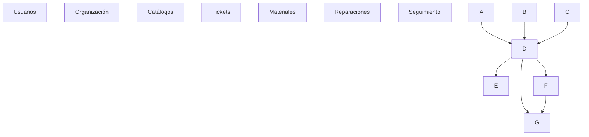
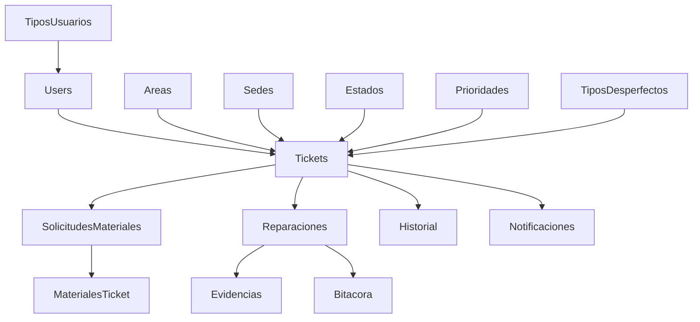

\# 01\_BASE\_DATOS.md

\# Modelo de Datos

> Arquitectura del modelo de persistencia de REPARA-79.

\*\*Versión:\*\* 1.0

\*\*Estado:\*\* Vigente

\*\*Fuente oficial:\*\* `rpr-79\_adaptado\_laravel\_corregido.sql`

\---

\# 1. Objetivo

Este documento describe el modelo de datos oficial del sistema \*\*REPARA-79\*\*.

Su propósito no es únicamente documentar la estructura de la base de datos, sino explicar el dominio del negocio representado por cada entidad y las relaciones existentes entre ellas.

El modelo de datos constituye la base sobre la cual se implementa toda la lógica del sistema. Cualquier modificación estructural deberá realizarse mediante nuevas migraciones de Laravel y reflejarse posteriormente en esta documentación.

\---

\# 2. Filosofía del modelo

El modelo fue diseñado siguiendo los siguientes principios:

\* Integridad referencial mediante claves foráneas.

\* Separación de responsabilidades entre entidades.

\* Uso de tablas catálogo para evitar valores literales.

\* Compatibilidad con Laravel 12 y Eloquent ORM.

\* Escalabilidad para futuras funcionalidades sin romper el diseño existente.

\* Representación explícita del flujo de mantenimiento.

El objetivo no es almacenar únicamente información, sino representar correctamente el proceso administrativo y técnico que sigue una solicitud de mantenimiento.

\---

\# 3. Organización del modelo

Las entidades del sistema pueden agruparse en siete dominios funcionales.

Cada dominio representa una responsabilidad específica dentro del sistema.

\---

\# 4. Dominios del modelo

| Dominio      | Entidades                                                 |

| ------------ | --------------------------------------------------------- |

| Usuarios     | users, tipos\_usuarios, usuario\_area                       |

| Organización | sedes, areas                                              |

| Catálogos    | estados\_ticket, prioridades\_ticket, tipos\_desperfectos    |

| Operación    | tickets                                                   |

| Materiales   | solicitudes\_materiales, materiales\_ticket                 |

| Reparaciones | reparaciones, evidencias\_reparacion, bitacoras\_reparacion |

| Seguimiento  | historial\_ticket, notificaciones                          |

\---

\# 5. Dominio de Usuarios

\## Propósito

Administrar la identidad de las personas que interactúan con el sistema y definir las responsabilidades funcionales de cada una.

Este dominio no administra permisos directamente; proporciona la información necesaria para que Laravel determine el comportamiento esperado según el tipo de usuario.

\### Entidades

\* `users`

\* `tipos\_usuarios`

\* `usuario\_area`

\---

\## users

Es la entidad principal del sistema.

Se utiliza la tabla nativa de Laravel con campos adicionales propios del proyecto.

Responsabilidades:

\* Identidad del usuario.

\* Autenticación.

\* Estado de la cuenta.

\* Información de contacto.

\* Último acceso.

\* Imagen de perfil.

\* Eliminación lógica.

El proyecto no utiliza una tabla personalizada de usuarios para mantener compatibilidad con el ecosistema de Laravel.

\---

\## tipos\_usuarios

Define el comportamiento funcional del usuario dentro del sistema.

Los tipos oficiales son:

\* Usuario Registrado.

\* Responsable del Lugar.

\* Personal de Mantenimiento.

\* Subdirector Administrativo.

El tipo de usuario determina las acciones disponibles en cada módulo.

\---

\## usuario\_area

Relaciona usuarios con las áreas bajo su responsabilidad.

Esta separación permite mantener un modelo flexible y preparado para futuras ampliaciones.

\---

\# 6. Dominio de Organización

\## sedes

Representa las sedes o planteles administrados por el sistema.

Aunque actualmente el proyecto se enfoca en un único plantel (CBTA No. 79), el modelo permite escalar a múltiples sedes sin modificaciones estructurales.

\---

\## areas

Representa las áreas físicas donde pueden reportarse desperfectos.

Cada Ticket pertenece obligatoriamente a un área.

Esto permite:

\* asignar responsables,

\* clasificar incidencias,

\* generar estadísticas,

\* segmentar consultas.

\---

\# 7. Dominio de Catálogos

Los catálogos contienen información parametrizable y evitan almacenar valores literales en las tablas operativas.

\---

\## estados\_ticket

Representa el ciclo de vida oficial de un Ticket.

Estados permitidos:

1\. Pendiente

2\. Valorado

3\. Autorizado

4\. En reparación

5\. Rechazado

6\. Reparado

El flujo permitido entre estos estados se documenta en `05\_FLUJO\_TICKETS.md`.

No deberán agregarse nuevos estados sin actualizar previamente el modelo de datos y las reglas de negocio.

\---

\## prioridades\_ticket

Define la prioridad asignada a un Ticket.

La prioridad es un catálogo independiente para facilitar:

\* ordenamiento,

\* filtrado,

\* generación de reportes,

\* cambios futuros sin modificar la tabla `tickets`.

\---

\## tipos\_desperfectos

Clasifica la naturaleza del desperfecto reportado.

Ejemplos:

\* Eléctrico.

\* Hidráulico.

\* Infraestructura.

\* Mobiliario.

Este catálogo facilita la generación de indicadores y reportes.

\---

\# 8. Dominio de Tickets

\## tickets

Es la entidad central del sistema.

Todo el flujo funcional gira alrededor de esta tabla.

Cada registro representa una solicitud formal de mantenimiento.

Un Ticket almacena la información necesaria para identificar:

\* quién reportó el desperfecto,

\* dónde ocurrió,

\* qué tipo de desperfecto es,

\* cuál es su prioridad,

\* en qué estado se encuentra,

\* cuándo fue reportado.

El Ticket no almacena información de materiales, reparaciones o evidencias; estas responsabilidades se delegan a entidades especializadas.

\---

\## Relaciones principales

Un Ticket mantiene relaciones con:

\* Usuario creador.

\* Área.

\* Sede.

\* Tipo de desperfecto.

\* Prioridad.

\* Estado.

\* Solicitud de materiales.

\* Reparación.

\* Historial.

\* Notificaciones.

\---

\# 9. Dominio de Materiales

\## Objetivo

Representar la propuesta técnica elaborada por el Personal de Mantenimiento.

Este dominio existe porque el Subdirector Administrativo no aprueba directamente el Ticket, sino la propuesta de materiales y costos.

\---

\## solicitudes\_materiales

Representa la valoración técnica realizada por el Personal de Mantenimiento.

Debe incluir:

\* materiales requeridos,

\* cantidades,

\* costos estimados.

Una valoración solo puede ser modificada cuando el Ticket asociado se encuentra en estado \*\*Rechazado\*\*.

Esta constituye una regla de negocio del sistema.

\---

\## materiales\_ticket

Almacena el detalle de materiales de cada valoración.

Cada material se registra de forma independiente para facilitar:

\* modificaciones,

\* consultas,

\* reportes,

\* cálculo de costos.

\---

\# 10. Dominio de Reparaciones

\## reparaciones

Representa la ejecución del trabajo autorizado.

Solo puede existir cuando el Ticket ha sido previamente autorizado.

Aquí se documenta:

\* descripción del trabajo,

\* técnico responsable,

\* fechas relevantes.

\---

\## evidencias\_reparacion

Almacena las evidencias fotográficas del proceso.

El flujo oficial contempla tres momentos principales:

\* Estado inicial.

\* Durante la reparación.

\* Resultado final.

El modelo permite almacenar múltiples evidencias por reparación.

\---

\## bitacoras\_reparacion

Registra cronológicamente la información técnica de la reparación concluida.

La creación de este registro forma parte del cierre del Ticket y servirá como base para la generación del reporte PDF.

\---

\# 11. Dominio de Seguimiento

\## historial\_ticket

Registra los cambios relevantes ocurridos durante el ciclo de vida del Ticket.

Ejemplos:

\* creación,

\* valoración,

\* autorización,

\* rechazo,

\* inicio de reparación,

\* reparación concluida.

El historial permite reconstruir la evolución completa de una solicitud.

\---

\## notificaciones

Registra las notificaciones emitidas por el sistema.

Ejemplos:

\* Ticket registrado.

\* Valoración completada.

\* Valoración rechazada.

\* Reparación finalizada.

El Responsable del Lugar recibirá la notificación correspondiente cuando el Ticket sea concluido.

\---

\# 12. Relaciones conceptuales

\---

\# 13. Decisiones de diseño

Las siguientes decisiones forman parte de la arquitectura del modelo:

| Decisión                                 | Justificación                                                                          |

| ---------------------------------------- | -------------------------------------------------------------------------------------- |

| Uso de `users` nativo de Laravel         | Mantener compatibilidad con Sanctum, Eloquent y autenticación.                         |

| Uso de tablas catálogo                   | Evitar duplicidad de información y valores literales.                                  |

| Separación entre Ticket y Reparación     | Un Ticket representa la solicitud; la Reparación representa la ejecución del trabajo.  |

| Separación entre Reparación y Evidencias | Permite múltiples fotografías sin duplicar información.                                |

| Separación entre Valoración y Materiales | Facilita modificaciones cuando la propuesta es rechazada.                              |

| Historial independiente                  | Mantiene la trazabilidad completa del proceso sin alterar el estado actual del Ticket. |

\---

\# 14. Reglas generales

Durante el desarrollo deberán respetarse las siguientes reglas:

\* No modificar el esquema sin autorización.

\* No crear tablas duplicadas.

\* No almacenar listas de materiales como texto libre.

\* No utilizar valores literales cuando exista un catálogo.

\* Toda modificación estructural deberá realizarse mediante nuevas migraciones.

\* Toda relación deberá implementarse mediante claves foráneas y relaciones Eloquent.

\---

\# 15. Relación con otros documentos

Este documento sirve como base para:

\* `02\_ARQUITECTURA.md`, donde se describe cómo interactúan las capas del sistema con este modelo.

\* `03\_CONVENCIONES.md`, que establece las reglas para trabajar sobre este esquema.

\* `05\_FLUJO\_TICKETS.md`, donde se documenta el uso funcional de estas entidades dentro del ciclo de vida del Ticket.

El modelo de datos aquí descrito constituye la representación oficial del dominio de persistencia de REPARA-79 y deberá mantenerse sincronizado con el script SQL definitivo del proyecto.

