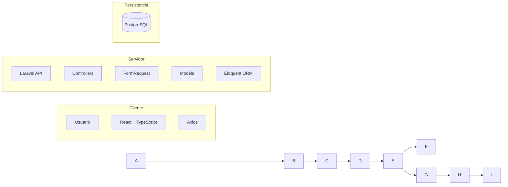
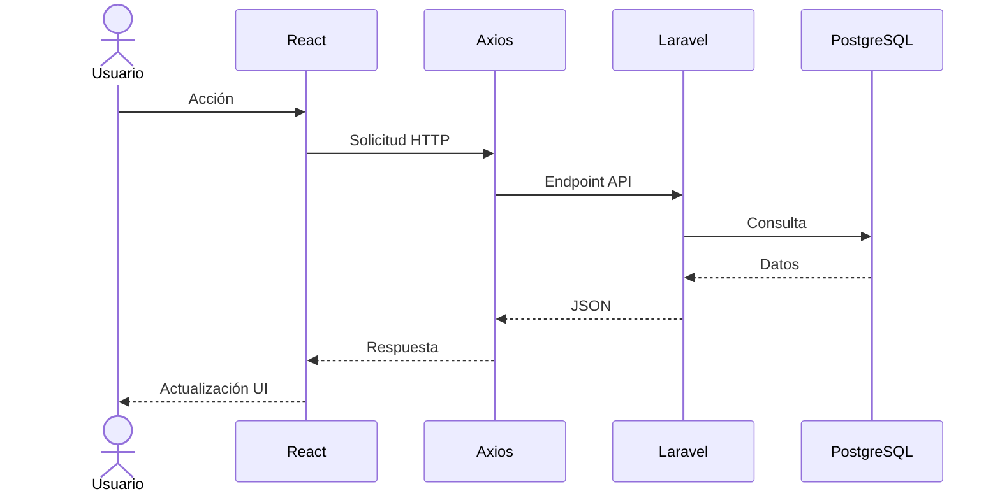

\# 02\_ARQUITECTURA.md


\# Arquitectura del Sistema


> Arquitectura lógica y técnica de REPARA-79.


\*\*Versión:\*\* 1.0

\*\*Estado:\*\* Vigente


\---


\# 1. Objetivo


Este documento describe la arquitectura oficial del sistema \*\*REPARA-79\*\*, definiendo la organización de sus componentes, la responsabilidad de cada capa y las reglas de interacción entre ellas.


Su objetivo es garantizar que cualquier funcionalidad nueva se desarrolle respetando la arquitectura existente, evitando acoplamientos innecesarios y manteniendo una separación clara entre la presentación, la lógica de negocio y la persistencia.


Este documento constituye la referencia arquitectónica oficial del proyecto.


\---


\# 2. Principios arquitectónicos


La arquitectura del sistema fue diseñada siguiendo los siguientes principios:


\* Separación de responsabilidades.

\* Bajo acoplamiento entre capas.

\* Alta cohesión.

\* Escalabilidad.

\* Mantenibilidad.

\* Reutilización.

\* Compatibilidad con Laravel y React.

\* Dominio de negocio centralizado en el Backend.


Todo el proyecto debe respetar estos principios.


\---


\# 3. Arquitectura general


REPARA-79 implementa una arquitectura cliente-servidor desacoplada basada en una API REST.





La comunicación entre el cliente y el servidor se realiza exclusivamente mediante solicitudes HTTP.


El Frontend nunca interactúa directamente con la base de datos.


\---


\# 4. Responsabilidad de cada capa


\## 4.1 Frontend


Tecnologías:


\* React

\* TypeScript

\* Vite


Responsabilidades:


\* Presentación de información.

\* Navegación.

\* Componentes visuales.

\* Formularios.

\* Validaciones de interfaz.

\* Consumo de la API.


No contiene lógica de negocio crítica.


Las decisiones funcionales siempre pertenecen al Backend.


\---


\## 4.2 Axios


Axios representa la capa de comunicación con la API.


Toda solicitud HTTP deberá realizarse mediante una instancia centralizada.


Responsabilidades:


\* Configurar la URL base.

\* Enviar cookies de sesión de Sanctum.

\* Gestionar encabezados.

\* Manejar interceptores.

\* Uniformar respuestas y errores.


No deberán utilizarse llamadas directas mediante `fetch()`.


\---


\## 4.3 Backend


Tecnología:


Laravel 12


Responsabilidades:


\* Autenticación.

\* Autorización.

\* Validaciones.

\* Reglas de negocio.

\* Gestión de estados.

\* Persistencia.

\* Integridad del flujo de Tickets.


Toda regla del dominio deberá implementarse en esta capa.


\---


\## 4.4 Base de datos


Tecnología:


PostgreSQL


Responsabilidades:


\* Persistencia.

\* Integridad referencial.

\* Relaciones.

\* Historial.

\* Catálogos.

\* Información del dominio.


La base de datos no debe contener lógica de negocio.


\---


\# 5. Flujo de una solicitud HTTP


Toda interacción con el sistema sigue el siguiente recorrido.





Este flujo aplica para todas las operaciones del sistema.


\---


\# 6. Flujo interno del Backend


Cuando Laravel recibe una solicitud, deberá procesarla siguiendo la siguiente secuencia.


```mermaid

flowchart TD


A\[Request]


↓


B\[Middleware]


↓


C\[Controller]


↓


D\[FormRequest]


↓


E\[Lógica de negocio]


↓


F\[Eloquent]


↓


G\[PostgreSQL]


↓


H\[Respuesta JSON]

```


Cada componente tiene una responsabilidad específica.


No deberán omitirse etapas salvo justificación técnica.


\---


\# 7. Organización del Backend


La estructura esperada del proyecto Laravel es la estándar del framework.


```text

app/


├── Http/

│   ├── Controllers/

│   ├── Requests/

│   └── Middleware/

│

├── Models/

│

├── Policies/

│

├── Providers/

│

└── Services/ (si en el futuro se requieren)

```


\## Controllers


Responsables únicamente de coordinar la solicitud.


No deberán contener reglas complejas.


\---


\## FormRequest


Responsables de validar la información recibida.


Toda validación deberá centralizarse aquí.


\---


\## Models


Representan las entidades del dominio y sus relaciones.


Cada modelo deberá declarar explícitamente sus relaciones Eloquent.


\---


\## Policies


Controlarán el acceso a funcionalidades sensibles según el tipo de usuario autenticado.


\---


\# 8. Organización del Frontend


La estructura recomendada para el proyecto React es la siguiente.


```text

src/


├── assets/

├── components/

├── hooks/

├── layouts/

├── pages/

├── routes/

├── services/

├── types/

└── utils/

```


Cada carpeta deberá mantener una única responsabilidad.


\---


\# 9. Arquitectura del módulo Tickets


El módulo Tickets seguirá la arquitectura definida para todo el sistema.


```mermaid

flowchart LR


Vista React


↓


Axios


↓


API Laravel


↓


Controller


↓


FormRequest


↓


Modelo Ticket


↓


Relaciones Eloquent


↓


PostgreSQL

```


La lógica del flujo de Tickets nunca deberá implementarse en React.


\---


\# 10. Arquitectura del flujo de mantenimiento


El proceso de mantenimiento representa el dominio principal del sistema.


```mermaid

flowchart TD


Usuario


↓


Ticket


↓


Valoración


↓


Autorización


↓


Reparación


↓


Evidencias


↓


Bitácora


↓


PDF


↓


Notificación

```


Cada una de estas etapas se encuentra respaldada por entidades específicas del modelo de datos.


\---


\# 11. Eventos del sistema


Existen procesos que no representan acciones directas del usuario, sino consecuencias de cambios en el flujo.


Ejemplos:


\* Registrar historial.

\* Generar bitácora.

\* Generar PDF.

\* Emitir notificaciones.


Estos procesos deberán ejecutarse automáticamente cuando corresponda.


La implementación recomendada en Laravel es mediante \*\*Events\*\* y \*\*Listeners\*\*, o mediante una capa de servicios si el proyecto lo requiere en el futuro.


\---


\# 12. Responsabilidades por tipo de usuario


| Rol                        | Responsabilidad principal                                                             |

| -------------------------- | ------------------------------------------------------------------------------------- |

| Usuario Registrado         | Registrar Tickets y consultar su seguimiento.                                         |

| Responsable del Lugar      | Registrar Tickets, consultar su estado y recibir el reporte final.                    |

| Personal de Mantenimiento  | Valorar Tickets, registrar materiales, ejecutar reparaciones y documentar evidencias. |

| Subdirector Administrativo | Administrar el sistema y aprobar o rechazar las valoraciones técnicas.                |


La arquitectura deberá garantizar que cada rol solo pueda ejecutar las acciones permitidas.


\---


\# 13. Decisiones arquitectónicas


| Decisión                     | Justificación                                                       |

| ---------------------------- | ------------------------------------------------------------------- |

| React desacoplado de Laravel | Permite independencia entre cliente y servidor.                     |

| Axios como única capa HTTP   | Centraliza la comunicación y el manejo de errores.                  |

| Laravel como API REST        | Centraliza el dominio del negocio y facilita futuras integraciones. |

| PostgreSQL                   | Proporciona robustez e integridad referencial.                      |

| Eloquent ORM                 | Simplifica la persistencia y mantiene consistencia con Laravel.     |

| FormRequest                  | Centraliza las validaciones y evita duplicidad de lógica.           |

| Sanctum                      | Solución oficial de Laravel para autenticación de SPA.              |


\---


\# 14. Restricciones arquitectónicas


Durante el desarrollo deberán respetarse las siguientes restricciones:


\* El Frontend nunca accederá directamente a PostgreSQL.

\* React no implementará reglas de negocio.

\* Toda validación funcional se realizará en Laravel.

\* El modelo de datos deberá respetarse íntegramente.

\* Toda modificación estructural se realizará mediante migraciones.

\* No se crearán APIs duplicadas.

\* No se romperá el flujo oficial del módulo Tickets.


\---


\# 15. Relación con otros documentos


Este documento debe leerse junto con:


\* \*\*00\_CONTEXTO.md\*\*: proporciona la visión general del proyecto.

\* \*\*01\_BASE\_DATOS.md\*\*: describe el modelo de persistencia que soporta esta arquitectura.

\* \*\*03\_CONVENCIONES.md\*\*: define las reglas obligatorias para desarrollar sobre esta arquitectura.

\* \*\*05\_FLUJO\_TICKETS.md\*\*: describe el comportamiento funcional implementado sobre esta arquitectura.


La arquitectura aquí definida constituye el marco técnico oficial sobre el cual deberá construirse cualquier funcionalidad presente o futura del sistema.


