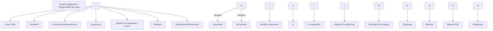

\# 05\_FLUJO\_TICKETS.md

\# Especificación Funcional del Módulo de Tickets

> Documento funcional oficial del flujo de Tickets de REPARA-79.

\*\*Versión:\*\* 1.0

\*\*Estado:\*\* Vigente

\---

\# 1. Objetivo

Este documento define el comportamiento funcional del módulo de Gestión de Tickets de REPARA-79.

Su propósito es describir el proceso completo de atención de un desperfecto de mantenimiento, desde el momento en que es reportado hasta la generación del reporte técnico final.

El flujo aquí documentado constituye la especificación funcional oficial del proyecto y deberá respetarse durante toda la implementación.

\---

\# 2. Objetivo del módulo

El módulo de Tickets permite administrar de forma controlada el ciclo de vida de una solicitud de mantenimiento.

Cada Ticket representa una incidencia detectada dentro de una sede o área de la institución y constituye el punto de inicio del proceso administrativo y técnico de reparación.

El módulo garantiza:

\* Registro de la incidencia.

\* Valoración técnica.

\* Control administrativo.

\* Documentación de la reparación.

\* Trazabilidad completa.

\* Generación de evidencia documental.

\---

\# 3. Actores del sistema

\## 3.1 Usuario Registrado

Es el usuario que detecta un desperfecto en un área bajo su responsabilidad.

Puede:

\* Registrar Tickets.

\* Consultar el estado de sus Tickets.

\* Consultar el historial de sus Tickets.

No puede modificar estados ni intervenir en el proceso de valoración.

\---

\## 3.2 Responsable del Lugar

Corresponde al responsable del espacio físico donde ocurrió el desperfecto.

Puede ser la misma persona que reportó el Ticket.

Puede:

\* Registrar Tickets.

\* Consultar Tickets de su área.

\* Consultar el reporte técnico final.

\* Recibir la notificación de reparación concluida.

\---

\## 3.3 Personal de Mantenimiento

Es el responsable técnico de atender las incidencias.

Puede:

\* Consultar Tickets pendientes.

\* Inspeccionar desperfectos.

\* Elaborar la valoración técnica.

\* Registrar materiales.

\* Registrar costos.

\* Corregir la valoración cuando sea rechazada.

\* Iniciar la reparación.

\* Registrar evidencias.

\* Documentar el trabajo realizado.

\* Finalizar la reparación.

\---

\## 3.4 Subdirector Administrativo

Es el responsable administrativo del sistema.

Posee el mayor nivel de control.

Puede:

\* Revisar valoraciones.

\* Aprobar valoraciones.

\* Rechazar valoraciones indicando el motivo.

\* Administrar usuarios.

\* Cambiar el tipo de usuario.

\* Promover usuarios a Subdirector Administrativo.

\* Administrar áreas.

\* Asignar responsables.

\* Consultar todos los Tickets.

\---

\# 4. Estados oficiales del Ticket

Los únicos estados válidos son:

| Orden | Estado        |

| ----: | ------------- |

|     1 | Pendiente     |

|     2 | Valorado      |

|     3 | Autorizado    |

|     4 | En reparación |

|     5 | Rechazado     |

|     6 | Reparado      |

Estos estados se obtienen exclusivamente del catálogo `estados\_ticket`.

No deberán utilizarse valores literales.

\---

\# 5. Flujo principal

Este flujo representa el comportamiento oficial del sistema.

\---

\# 6. Descripción del flujo

\## 6.1 Registro del Ticket

Actor:

\* Usuario Registrado.

\* Responsable del Lugar.

El usuario registra el desperfecto proporcionando la información requerida.

Al finalizar:

\* Se crea el Ticket.

\* Se registra en el historial.

\* El estado inicial es \*\*Pendiente\*\*.

\---

\## 6.2 Valoración técnica

Actor:

Personal de Mantenimiento.

El técnico inspecciona el desperfecto y registra:

\* materiales propuestos,

\* cantidades,

\* costos estimados.

Una vez completada la valoración:

\* el Ticket cambia automáticamente a \*\*Valorado\*\*.

\---

\## 6.3 Revisión administrativa

Actor:

Subdirector Administrativo.

El Subdirector revisa la valoración presentada.

Puede tomar una de dos decisiones.

\### Aprobar

La propuesta es aceptada.

Consecuencia:

El Ticket cambia automáticamente al estado \*\*Autorizado\*\*.

\---

\### Rechazar

La propuesta es rechazada.

Debe registrarse un motivo de rechazo.

Consecuencia:

El Ticket cambia automáticamente al estado \*\*Rechazado\*\*.

\---

\## 6.4 Corrección de la valoración

Actor:

Personal de Mantenimiento.

Cuando un Ticket se encuentra en estado \*\*Rechazado\*\*, el técnico puede modificar:

\* materiales,

\* cantidades,

\* costos.

Una vez actualizada la valoración:

\* el Ticket vuelve automáticamente al estado \*\*Valorado\*\* para una nueva revisión administrativa.

\---

\## 6.5 Inicio de la reparación

Actor:

Personal de Mantenimiento.

Solo un Ticket \*\*Autorizado\*\* puede pasar al estado \*\*En reparación\*\*.

Este cambio indica que la reparación ha comenzado formalmente.

\---

\## 6.6 Ejecución de la reparación

Durante esta etapa el Personal de Mantenimiento deberá registrar:

\* descripción del trabajo,

\* evidencia fotográfica inicial,

\* evidencia durante la reparación,

\* evidencia final.

El sistema deberá conservar toda esta información asociada a la reparación correspondiente.

\---

\## 6.7 Finalización

Al concluir la reparación:

\* el Ticket cambia automáticamente al estado \*\*Reparado\*\*.

Este cambio marca el cierre operativo del Ticket.

\---

\# 7. Procesos automáticos

El cambio al estado \*\*Reparado\*\* desencadena automáticamente los siguientes procesos.

\## 7.1 Registro en bitácora

Se crea un registro permanente con la información principal de la reparación.

\---

\## 7.2 Generación del reporte PDF

El sistema genera automáticamente un documento PDF que resume la intervención realizada.

El reporte deberá incluir como mínimo:

\### Información general

\* ID de la bitácora.

\* Fecha de generación.

\* ID del Ticket.

\* Estado final.

\---

\### Información del desperfecto

\* Tipo de desperfecto.

\* Descripción.

\* Área.

\* Sede.

\* Fecha del reporte.

\* Usuario que registró el Ticket.

\* Personal de Mantenimiento responsable.

\---

\### Materiales

\* Material.

\* Cantidad.

\* Precio unitario.

\* Subtotal.

\* Costo total.

\---

\### Reparación

\* Descripción del trabajo realizado.

\* Evidencia inicial.

\* Evidencia durante la reparación.

\* Evidencia final.

\---

\## 7.3 Notificación

El sistema genera una notificación dirigida al Responsable del Lugar indicando que la reparación ha sido concluida.

\---

\# 8. Reglas de negocio

\## RN-001

Todo Ticket inicia en estado \*\*Pendiente\*\*.

\---

\## RN-002

Solo un Usuario Registrado o un Responsable del Lugar pueden crear Tickets.

\---

\## RN-003

Todo Ticket debe pertenecer a una sede y a un área.

\---

\## RN-004

Solo el Personal de Mantenimiento puede registrar una valoración.

\---

\## RN-005

Toda valoración debe incluir materiales y costos.

\---

\## RN-006

Solo el Subdirector Administrativo puede aprobar o rechazar una valoración.

\---

\## RN-007

Toda valoración rechazada deberá incluir un motivo.

\---

\## RN-008

La lista de materiales únicamente podrá modificarse cuando el Ticket se encuentre en estado \*\*Rechazado\*\*.

\---

\## RN-009

Toda modificación de la valoración devuelve el Ticket al estado \*\*Valorado\*\*.

\---

\## RN-010

Solo un Ticket \*\*Autorizado\*\* puede pasar al estado \*\*En reparación\*\*.

\---

\## RN-011

Durante el estado \*\*En reparación\*\* deberán registrarse las evidencias fotográficas requeridas y la descripción del trabajo realizado.

\---

\## RN-012

Al finalizar la reparación el Ticket cambia automáticamente al estado \*\*Reparado\*\*.

\---

\## RN-013

Todo Ticket \*\*Reparado\*\* genera automáticamente:

\* Bitácora.

\* Reporte PDF.

\* Notificación.

\---

\# 9. Matriz de permisos

| Funcionalidad             | Usuario Registrado | Responsable del Lugar | Personal de Mantenimiento | Subdirector Administrativo |

| ------------------------- | :----------------: | :-------------------: | :-----------------------: | :------------------------: |

| Crear Ticket              |          ✅         |           ✅           |             ❌             |              ❌             |

| Consultar Tickets propios |          ✅         |           ✅           |             ✅             |              ✅             |

| Valorar Ticket            |          ❌         |           ❌           |             ✅             |              ❌             |

| Registrar materiales      |          ❌         |           ❌           |             ✅             |              ❌             |

| Modificar valoración      |          ❌         |           ❌           |     Solo en Rechazado     |              ❌             |

| Aprobar valoración        |          ❌         |           ❌           |             ❌             |              ✅             |

| Rechazar valoración       |          ❌         |           ❌           |             ❌             |              ✅             |

| Iniciar reparación        |          ❌         |           ❌           |             ✅             |              ❌             |

| Registrar evidencias      |          ❌         |           ❌           |             ✅             |              ❌             |

| Finalizar reparación      |          ❌         |           ❌           |             ✅             |              ❌             |

| Administrar usuarios      |          ❌         |           ❌           |             ❌             |              ✅             |

| Administrar áreas         |          ❌         |           ❌           |             ❌             |              ✅             |

\---

\# 10. Responsabilidades del Backend

El Backend deberá:

\* Validar todas las solicitudes.

\* Controlar las transiciones de estado.

\* Aplicar las reglas RN-001 a RN-013.

\* Registrar el historial del Ticket.

\* Gestionar la persistencia de materiales, reparaciones y evidencias.

\* Ejecutar los procesos automáticos al finalizar una reparación.

Toda la lógica de negocio deberá implementarse en Laravel.

\---

\# 11. Responsabilidades del Frontend

El Frontend deberá:

\* Presentar formularios.

\* Mostrar el estado actual del Ticket.

\* Consumir la API.

\* Representar el flujo de manera clara para el usuario.

\* Mostrar mensajes de validación y errores.

No deberá decidir cambios de estado ni aplicar reglas de negocio.

\---

\# 12. Consideraciones finales

El flujo documentado en este archivo representa el proceso oficial de mantenimiento de REPARA-79.

Cualquier modificación al comportamiento del módulo deberá actualizar este documento antes de implementarse en el código.

Este documento constituye la referencia funcional principal del proyecto y deberá utilizarse conjuntamente con:

\* `00\_CONTEXTO.md`

\* `01\_BASE\_DATOS.md`

\* `02\_ARQUITECTURA.md`

\* `03\_CONVENCIONES.md`

\* `04\_ESTADO\_ACTUAL.md`

Su cumplimiento es obligatorio para el equipo de desarrollo, el personal de QA y cualquier asistente de IA que participe en la evolución del sistema.

